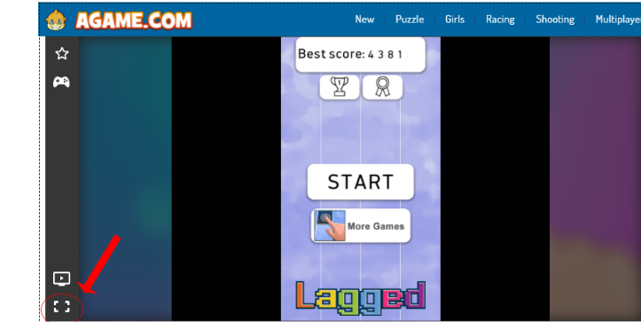

# Automating Piano Tiles Game using python


The Idea of the project is to automate the piano tiles game that can work on any screen resolution and <br />
If the game is running on the specific website that is mentioned here.
<br />
(Note): This project only runs on windows since we are using win32api (available only for windows).

## Instructions to setup the project

1. Clone the project:
open cmd as administrator and type in the following command <br /> 
(or) <br />
download and extract the zip:

```
git clone https://github.com/ahn1305/Piano-Tiles-Auto.git
```
2. Install the required packages
cd into the directory and install these libraries from an administrator terminal:
```
pip install pywin32
pip install keyboard
pip install pyautogui
pip install opencv-python
```
3. Go to https://www.agame.com/game/magic-piano-tiles and click on play button.

4. The open cmd inside the project and run the Bot.py file:
```
python .\Bot.py
```
&nbsp;&nbsp;&nbsp;&nbsp;Now there will be a 15 sec gap, during this time follow the 5th step

5. Go the website opened and click on ``` f11 ``` Button to enter full screen <br />
then press on the following button shown in the image below

 <br />

Now your screen should be looking something like this:

 <br />


